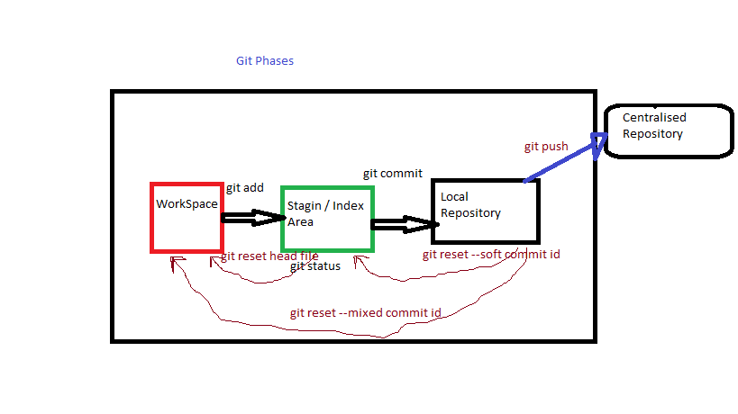

  ##              GIT

 #### 1. Git is used to Source code management
 #### 2. Git is opensource
 #### 3. it is a distributed repository management
      distributed means it will have two repositories
          Local repository
              Developers will write  code push the code into Central repository
          Central repository
              Developers will push the code into repository
 #### 4. Here we are working on branches.
 #### 5. if any bugs detected in latest commit we can ROLL_BACK to previous commit 
 #### 6. Git will maintain all versions of commits, so we can rollback easily
 #### 7. Git will maintain all the details about commit like developer name and EMAIL TIME DATE in LOGS
 #### 8. Git has Three phases
      1. WORKSPACE
      2. STAGING / INDEXING AREA
      3. LOCAL REPOSITORY

##      Git Commands 
#### 1. To initialise a git repository
        git init

#### 2. to set usename and email
        git config --global user.name <user name>
        git config --global user.email "some@gmail.com"

#### 3. To see the all configuration files 
        git config --list

#### 4. To Track the files whether Tracked or UnTracked
        git status

#### 5. To add workspace or UnTracked files into Staging/Index area
    to add all untarcked files to Index area
        git add .  

    if you want to add particular file
        git add <file>

#### 6. To move staged changes to  Local repository 

        git commit -m "commit message"

#### 7. To check Logs or Commits

        git log
  git log will display commit    ids(SHA format) with modified   or commit  date

#### 8. To push  Local repository  code to  Central Repository 

        git push 

#### 9. To see many logs comfortably
    
        git log --oneline
        git log --oneline -<number>
        git log -n
    note: will give n nuber of commits
    
#### 10. To get particular author logs

        git log --author=<name>
        git log --since=yy-mm-dd 
        git log --until=yy-mm-dd

        git log --oneline --decorate 
    note: will give commits of all branches

#### 11. To reset Local Repository files to Staging Area
    
        git reset --soft 
    note: give parent commit id to reset last commit

#### 12. To move Staging area file to Workspace
        git reset --hard
        git reset head <file>

#### 12.A To remove untracked files 
        git clean

#### 13. TO reset From Local Repository to directly Workspace

        git reset --mixed <commitid>

#### 14. To create a branch and move into the branch

    note: creating branch
        git branch <branch name>

    note: moving into the branch
        git checkout <branchname>

    note: moving into the branch while creating 
        git checkout -b <branchname>

#### 15. To merge changed commits from one branch to other

    note: here, first you have to be in destination barnch and give the source branch
        git merge <source_branch>
    
#### 16. To save the code 

        git stash

#### 17. To rollback / reset to staging area from stash memory

        git stash pop

    note: to rollback particular one 
        git stash pop <stash_name>

#### 18. To set aliases for a command in git

        git config --global alias.log "l"

#### 19. TO remove an alias from git

        git config --global --unset alias.l

#### 20. what is .gitignore file
     to hide any file from git workspace

#### 21. To create tag

        git tag <tag_name>

#### 22. To delete tag

        git push origin -d <tag_name>

#### 23. To change commit message
    
    note: you can change commit message for only last commit
        git commit --amend -m "message"
        
#### 24. To add changes when immediate deletion

    note: if >> git rm << is used changes will be staged directly
    >> git rm <file_name>

#### 25. 